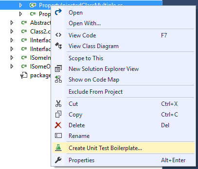
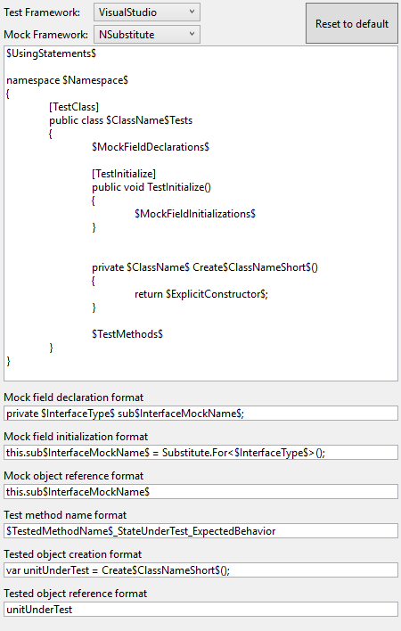

# Unit Test Boilerplate Generator

Download this extension from the [VS Marketplace](https://marketplace.visualstudio.com/items?itemName=RandomEngy.UnitTestBoilerplateGenerator)
or get the [CI build](http://vsixgallery.com/extension/UnitTestBoilerplate.RandomEngy.ca0bb824-eb5a-41a8-ab39-3b81f03ba3fe/).

---------------------------------------

Generates a unit test boilerplate from a given C# class, setting up mocks for all dependencies and test outlines for all public methods.

Test frameworks supported:
* Visual Studio
* NUnit
* xUnit

Mock frameworks supported:
* Moq
* AutoMoq
* NSubstitute
* SimpleStubs
* Rhino Mocks
* FakeItEasy

Dependency injection modes supported:
* Constructor injection via any IoC framework
* Property injection via Unity, Ninject or Grace

Right click an item in Solution Explorer and choose "Create Unit Test Boilerplate" .

This will create a test class in the same relative path as the class in a specified unit test project.
All the dependencies are mocked and saved as fields which are created fresh for each test via [TestInitialize]. In addition, all public methods
on the tested class are set up with a test method outline:

Each mocking framework has its own pattern.

## Other features
* Customize the unit test output via templates: Go to Options > Unit Test Boilerplate Generator > Templates

[Supported format tokens documentation](https://github.com/Microsoft/UnitTestBoilerplateGenerator/wiki/Custom-Format-Tokens)

* Supports mocking generic interfaces
* Automatically brings in appropriate using statements
* Applies any user-specific formatting rules to the generated code
* Automatically detects which mocking library and test framework you're using

See the [changelog](https://raw.githubusercontent.com/Microsoft/UnitTestBoilerplateGenerator/master/CHANGELOG.md) for changes and roadmap. If you'd like to see support for other mocking
frameworks or other IoC frameworks, [open an issue](https://github.com/Microsoft/UnitTestBoilerplateGenerator/issues/new).

## Contribute
Check out the [contribution guidelines](https://raw.githubusercontent.com/Microsoft/UnitTestBoilerplateGenerator/master/CONTRIBUTING.md)
if you want to contribute to this project.

For cloning and building this project yourself, make sure
to install the
[Extensibility Tools](https://marketplace.visualstudio.com/items?itemName=MadsKristensen.ExtensibilityTools)
extension for Visual Studio which enables some features
used by this project.

## License
[MIT](https://raw.githubusercontent.com/Microsoft/UnitTestBoilerplateGenerator/master/LICENSE)
